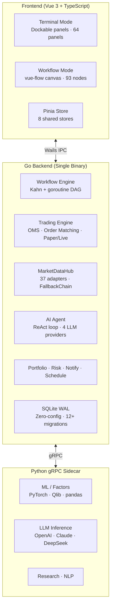

<p align="center">
  <picture>
    <source media="(prefers-color-scheme: dark)" srcset="https://img.shields.io/badge/QuantFlow-Terminal-111827?style=for-the-badge&logo=data:image/svg%2bxml;base64,PHN2ZyB4bWxucz0iaHR0cDovL3d3dy53My5vcmcvMjAwMC9zdmciIHdpZHRoPSI0MCIgaGVpZ2h0PSI0MCIgdmlld0JveD0iMCAwIDI0IDI0IiBmaWxsPSJub25lIiBzdHJva2U9IiNmZmZmZmYiIHN0cm9rZS13aWR0aD0iMiIgc3Ryb2tlLWxpbmVjYXA9InJvdW5kIiBzdHJva2UtbGluZWpvaW49InJvdW5kIj48cGF0aCBkPSJNMjIgMTIuMjJ2LS43N2E5IDkgMCAwIDAtMTAtOC4wN0EzLjUgMy41IDAgMCAwIDIgNi41djMuM2ExMCAxMCAwIDAgMCA1IDguNjd2MS4wM2ExLjUgMS41IDAgMCAwIDMgMHYtMS4zYTEwIDEwIDAgMCAwIDUtOC42M3oiLz48cGF0aCBkPSJNMTIgMjJWMTIuMjIiLz48cGF0aCBkPSJNMTIgMi41djQuMjIiLz48cGF0aCBkPSJNMTYgMTUuNDJhNCA0IDAgMCAwLTgtMHYtMy4yIi8+PC9zdmc+">
    
  </picture>
</p>

<h1 align="center">QuantFlow Terminal</h1>

<p align="center">
  <strong>Dual-Mode Quantitative Finance Terminal — Bloomberg-Style Panels × Visual Workflow Orchestration</strong>
</p>

<p align="center">
  <a href="#-project-status"></a>
  <a href="#-project-status"></a>
  <a href="#-project-status"></a>
  <a href="#-project-status"></a>
  <a href="#-project-status"></a>
  <br>
  <a href="https://golang.org"></a>
  <a href="https://vuejs.org"></a>
  <a href="https://www.sqlite.org"></a>
  <a href="https://www.python.org"></a>
  <a href="LICENSE"></a>
</p>

<p align="center">
  <a href="README.md">中文</a> ·
  <a href="README.en.md">English</a> ·
  <a href="#-quick-start">Quick Start</a> ·
  <a href="#-architecture">Architecture</a>
</p>

---

## Architecture



**Bidirectional Flow**:
- **Terminal → Workflow**: Any panel's `[⊕]` generates a workflow node instantly
- **Workflow → Terminal**: Execution results `[Pin to Panel]` become live monitors

---

## Project Status

| Component | Status |
|-----------|:------:|
| Workflow Engine (DAG + goroutine + Kahn) | ✅ |
| Desktop Shell (Wails v3 + Vue 3 + TS) | ✅ |
| Trading Engine (OMS + Paper/Live) | ✅ |
| MarketDataHub (37 adapters, FallbackChain, MAC) | ✅ |
| Backtesting Engine (CN/US/HK/CRYPTO rules) | ✅ |
| Python gRPC Sidecar | ✅ |
| AI Agent System (ReAct + 4 LLM + 15 skills) | ✅ |
| Broker Integration (Alpaca + Binance live) | ✅ |
| Portfolio & Risk (VaR/CVaR/Sharpe/MaxDD) | ✅ |
| Notifications + Scheduler (Telegram + cron) | ✅ |
| Theme System (dark/light + 3 densities) | ✅ |
| Internationalization (zh/en, ~350 keys each) | ✅ |
| SQLite WAL Storage (zero-config, single file) | ✅ |

---

## Core Features

### Workflow Nodes · 93 · 18 Categories

<details>
<summary>Expand all categories</summary>

| Category | Count | Key Nodes |
|----------|:-----:|-----------|
| Data Loading | 4 | DataLoader, Merge, Filter, Resample |
| Indicators | 20 | SMA, MACD, RSI, EMA, Bollinger, OBV, MFI, PSY, etc. |
| Chanlun | 5 | Bi, Duan, Zhongshu, Maidian, Leixing |
| Alpha Factors | 12 | pct_change, rank, zscore, cross_over, if_else, etc. |
| Signal Engineering | 8 | CrossSignal, Threshold, hold/entry/exit signals |
| Strategy | 1 | StrategyNode (cross/RSI/momentum/custom) |
| Backtest | 1 | BacktestNode (CN/US/HK/CRYPTO) |
| Slippage | 3 | Fixed / Percentage / VolumeSlippage |
| Trading | 4 | PlaceOrder, CancelOrder, OrderQuery, PositionQuery |
| Portfolio | 3 | PortfolioSummary, RiskMetrics, Allocation |
| Risk | 2 | StopLoss, PositionSizer |
| ML Engine | 8 | Feature Engineering + Train/Predict/Evaluate + RL×3 |
| AI Agent | 2 | FactorNode, AgentNode |
| Notify | 2 | Notify, Alert |
| Control Flow | 3 | Loop, if_condition, sub_workflow |
| Schedule | 2 | Schedule, Wait |
| Research | 6 | Sentiment, StockResearch, Financials, Peers, Estimates, Insider |
| Utility | 5 | HTTPRequest, MathOperation, JSONParse, chart_data, fqfactor |

</details>

### Frontend Panels · 64

<details>
<summary>Expand all categories</summary>

| Category | Panels |
|----------|--------|
| **Market** (6) | Watchlist, QuoteDetail, Candlestick, MarketOverview, MarketDepth, Heatmap |
| **Ticker** (1) | TickerTape |
| **Trading** (8) | OrderEntry, OrderBlotter, Execution, BasketOrder, Position, PositionDetail, BrokerConfig, BrokerStatus |
| **Portfolio** (3) | PortfolioSummary, Rebalance, RiskDashboard |
| **Research** (8) | StockResearch, Financials, Sentiment, PeerComparison, AnalystEstimates, InsiderTrading, CongressTrading, FactorAnalysis |
| **Chart** (5) | EquityCurve, Correlation, Distribution, MonteCarlo, SurfaceChart |
| **AI/ML** (5) | AIChat, ModelRegistry, PredictionDashboard, AlphaMining, RLMonitor |
| **Backtest** (1) | BacktestResult |
| **Factor** (1) | FQFactor |
| **Crypto** (1) | CryptoOverview |
| **Chanlun** (3) | ChanlunBi, ChanlunDuan, ChanlunZhongshu |
| **News** (1) | News |
| **Tools** (3) | Drawing, ActionCenter, MACProtocol |
| **System** (4) | Schedule, Notify, Settings, SystemMonitor |

</details>

### Data Adapters · 37 · 4 Markets

<details>
<summary>Expand details</summary>

| Market | Adapters | Count |
|--------|----------|:-----:|
| **CN (A-Share)** | Mootdx(TDX) · MAC Protocol(TCP) · Sina · EastMoney · Tencent · Baidu · AKShare · TuShare · THS · cninfo · iwencai | **11 sources** |
| **HK** | Sina · AKShare/Tencent · Yahoo | **3 sources** |
| **US** | Yahoo(v8) · Finnhub · Polygon · Alpaca | **4 sources** |
| **Crypto** | Gate.io · Binance · OKX · CoinGecko | **4 sources** |
| **Specialized** | News/Global/Capital/Concept/Signals/Financials/Block/MAC | **15 sources** |

</details>

### AI Agent System

- **ReAct Loop**: think → act → observe, with timeout + step limits
- **4 LLM Providers**: OpenAI · Anthropic · DeepSeek · Ollama (local)
- **15 Skills**: technical analysis, fundamentals, risk, strategies, microstructure
- **Streaming Output**: SSE → Markdown rendering + tool call visualization

### Broker Support

| Broker | Market | Status |
|--------|--------|:------:|
| **Alpaca** | US Stocks | ✅ Live |
| **Binance** | Crypto | ✅ Live |
| **Futu** | HK/US/CN | 🔧 Stub |

### Chanlun (缠论)

Bi / Duan / Zhongshu / Maidian / Leixing + 3 visualization panels.
Real-time computation via MAC Protocol TCP to TDX.

---

## Quick Start

### Prerequisites

- **Go** 1.22+
- **Node.js** 20+
- **Python** 3.12+ (optional, needed for ML/factors/LLM)

### Development

```bash
git clone https://github.com/SZWzz/QuantFlow.git
cd QuantFlow

# Dev mode (hot reload)
wails dev

# Full check
go vet ./... && go test ./...                             # Go backend
cd frontend && npx vue-tsc --noEmit && npx vitest run     # Frontend
cd python && python -m pytest tests/ -x -q                # Python
```

---

## Tech Stack

| Layer | Choice | Rationale |
|-------|--------|-----------|
| Backend | Go 1.22+ | Goroutines for DAG parallelism, single binary |
| Desktop Shell | Wails v3 | Go-native, zero IPC overhead |
| Frontend | Vue 3 + TypeScript | vue-flow canvas, Pinia state management |
| Database | SQLite (WAL) | Zero-config, single-file, desktop-grade concurrency |
| ML/AI | Python 3.12+ (gRPC) | pandas/numpy ecosystem, independent sidecar |
| Charts | ECharts | Financial charts + GL 3D |
| Theming | CSS Variables | Dual theme + 3 densities, runtime switch |

---

## Market Coverage

| Market | Settlement | Key Rules | Primary Sources |
|--------|-----------|-----------|-----------------|
| CN (A-Share) | T+1 | ±10%/±20% limits, stamp duty 0.05% | Mootdx / MAC / EastMoney / Sina / Tencent |
| HK | T+2 | Stock Connect, T+2 settlement | Sina / Tencent / AKShare / Yahoo |
| US | T+2 | PDT rule, wash sale | Yahoo / Finnhub / Polygon |
| Crypto | Instant | Funding rate, liquidation | Gate.io / Binance / OKX |

---

## License

[AGPL-3.0](LICENSE) © 2024–2026 QuantFlow Contributors
