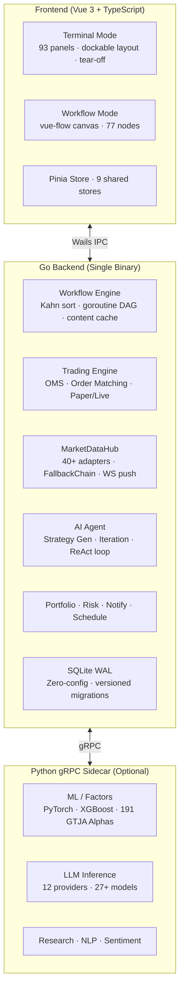

<p align="center">
  <picture>
    <source media="(prefers-color-scheme: dark)" srcset="https://img.shields.io/badge/QuantFlow-Terminal-111827?style=for-the-badge&logo=data:image/svg%2bxml;base64,PHN2ZyB4bWxucz0iaHR0cDovL3d3dy53My5vcmcvMjAwMC9zdmciIHdpZHRoPSI0MCIgaGVpZ2h0PSI0MCIgdmlld0JveD0iMCAwIDI0IDI0IiBmaWxsPSJub25lIiBzdHJva2U9IiNmZmZmZmYiIHN0cm9rZS13aWR0aD0iMiIgc3Ryb2tlLWxpbmVjYXA9InJvdW5kIiBzdHJva2UtbGluZWpvaW49InJvdW5kIj48cGF0aCBkPSJNMjIgMTIuMjJ2LS43N2E5IDkgMCAwIDAtMTAtOC4wN0EzLjUgMy41IDAgMCAwIDIgNi41djMuM2ExMCAxMCAwIDAgMCA1IDguNjd2MS4wM2ExLjUgMS41IDAgMCAwIDMgMHYtMS4zYTEwIDEwIDAgMCAwIDUtOC42M3oiLz48cGF0aCBkPSJNMTIgMjJWMTIuMjIiLz48cGF0aCBkPSJNMTIgMi41djQuMjIiLz48cGF0aCBkPSJNMTYgMTUuNDJhNCA0IDAgMCAwLTgtMHYtMy4yIi8+PC9zdmc+">
    
  </picture>
</p>

<h1 align="center">QuantFlow Terminal</h1>

<p align="center">
  <strong>Dual-Mode Quantitative Finance Terminal — Bloomberg-Style Panels × Visual Workflow Orchestration × AI Strategy Generation</strong>
</p>

<p align="center">
  <a href="#-project-status"></a>
  <a href="#-project-status"></a>
  <a href="#-project-status"></a>
  <a href="#-project-status"></a>
  <a href="#-project-status"></a>
  <br>
  <a href="https://golang.org"></a>
  <a href="https://vuejs.org"></a>
  <a href="https://www.sqlite.org"></a>
  <a href="https://www.python.org"></a>
  <a href="https://wails.io"></a>
  <a href="LICENSE"></a>
  <br>
  <a href="https://github.com/SZWzz/QuantFlow/actions"></a>
  <a href="https://github.com/SZWzz/QuantFlow/actions"></a>
</p>

<p align="center">
  <a href="README.md">中文</a> ·
  <a href="README.en.md">English</a> ·
  <a href="#-highlights">Highlights</a> ·
  <a href="#-quick-start">Quick Start</a> ·
  <a href="#-architecture">Architecture</a> ·
  <a href="CHANGELOG.md">Changelog</a>
</p>

---

## ✨ Highlights

<table>
<tr>
<td width="50%">

### 🧠 AI Strategy Generation
Natural language → Workflow DAG. LLM understands trading intent, generates executable strategies, auto-backtest validation.

</td>
<td width="50%">

### ⚡ Real-time WebSocket Push
Binance/OKX/Gate.io native WS connections, <100ms latency. Auto-reconnect with HTTP fallback resilience.

</td>
</tr>
<tr>
<td>

### 📊 93 Analysis Panels
Market data, trading, research, risk, alternative data… Bloomberg-style dockable layout with drag-and-drop and tear-off windows.

</td>
<td>

### 🔗 77 Composable Nodes
Data→Factors→Signals→Trading→Backtest. Kahn topological sort + goroutine-parallel DAG execution with content-addressed caching.

</td>
</tr>
<tr>
<td>

### 🌏 Four-Market Coverage
CN (A-Share) / HK / US / Crypto. T+1, price limits, stamp duty, PDT rules — all correctly implemented per market.

</td>
<td>

### 🔒 Local-First
SQLite single-file database, OS-native keychain encryption. Python sidecar is optional — core features work with pure Go.

</td>
</tr>
</table>

---

## 📐 Architecture



**Bidirectional Flow**:
- **Terminal → Workflow**: Any panel `[⊕]` generates a workflow node instantly
- **Workflow → Terminal**: Results `[Pin to Panel]` become live monitors

---

## 📊 Project Status

| Component | Status | Notes |
|-----------|:------:|-------|
| Workflow Engine (DAG + goroutine + content cache) | ✅ | 77 nodes · 20 categories |
| Desktop Shell (Wails v3 + Vue 3 + TS) | ✅ | Dual-mode · tear-off windows |
| Trading Engine (OMS + Paper/Live) | ✅ | 4 broker adapters |
| WebSocket Push (Binance/OKX/Gate.io) | ✅ | <100ms latency · auto-fallback |
| MarketDataHub (40+ adapters · FallbackChain) | ✅ | CN 11-source resilience |
| Backtesting Engine (CN/US/HK/CRYPTO rules) | ✅ | T+1/limits/PDT/Wash Sale |
| Python gRPC Sidecar | ✅ | ML/Factors/LLM/Data |
| AI Agent (Strategy Gen + Iteration + ReAct) | ✅ | NL→DAG auto-conversion |
| Convertible Bond Analysis (dual-low + BS + terms) | ✅ | A-Share CB market |
| Options Pricing (BS + Greeks + IV + Binomial) | ✅ | European/American · pure Go |
| Broker Integration (Alpaca · Binance · IBKR · Futu) | ✅ | Paper/Live environments |
| Panel Virtualization (hidden panels auto-sleep) | ✅ | DockTab visibility detection |
| Portfolio & Risk (VaR/CVaR/Sharpe/MaxDD) | ✅ | Multi-factor risk models |
| Notify + Scheduler (Telegram + cron) | ✅ | Conditional triggers |
| Theme System (dark/light + 3 densities) | ✅ | CSS variables · runtime switch |
| i18n (zh/en · ~350 keys each) | ✅ | vue-i18n |
| SQLite WAL (zero-config, single file) | ✅ | Versioned schema migrations |

---

## 🔧 Core Features

### Workflow Nodes · 77 · 20 Categories

<details>
<summary>Expand all categories</summary>

| Category | Count | Key Nodes |
|----------|:-----:|-----------|
| Data Loading | 5 | DataLoader, Merge, Filter, Resample, DataNormalize |
| Indicators | 5 | SMA, MACD, RSI, EMA, Bollinger |
| Alpha Factors | 13 | pct_change, delta, rank, zscore, cross_over, if_else, etc. |
| Signal Engineering | 8 | CrossSignal, Threshold, EntrySignal, ExitSignal, Rebalance, etc. |
| Strategy | 1 | StrategyNode (cross/RSI/momentum/custom) |
| Backtest | 1 | BacktestNode (CN/US/HK/CRYPTO) |
| Trading | 4 | PlaceOrder, CancelOrder, OrderQuery, PositionQuery |
| Portfolio | 2 | PortfolioSummary, Allocation |
| Risk | 4 | StopLoss, PositionSizer, RiskMetrics, RiskModel |
| ML Engine | 8 | FeatureEngineer, TrainModel, Predict, EvaluateModel, AlphaMining, RL×3 |
| AI Agent | 1 | Agent (LLM inference node) |
| Research | 8 | Sentiment, StockResearch, Financials, PeerCompare, CBScanner, etc. |
| Alternative Data | 4 | PredictionMarket, Geopolitics, GovData, Satellite |
| Notify | 2 | Notify, Alert |
| Control Flow | 3 | Loop, if_condition, sub_workflow |
| Schedule | 3 | Schedule, Wait, WebhookTrigger |
| Utilities | 3 | HTTPRequest, MathOp, JSONParse |
| Output | 2 | LogOutput, ChartData |

</details>

### Frontend Panels · 93

<details>
<summary>Expand all categories</summary>

| Category | Count | Panels |
|----------|:-----:|--------|
| **Market** | 17 | Watchlist, Candlestick, MarketOverview, Heatmap, DragonTiger, LimitUpDown, FundFlow, Margin, Funds, Futures, Bonds, SectorRotation, IPOCalendar, ExDividend, CBArbitrage, HKConnect, ShortInterest |
| **Trading** | 8 | OrderEntry, OrderBlotter, Execution, BasketOrder, Position, PositionDetail, BrokerConfig, BrokerStatus |
| **Portfolio** | 7 | PortfolioSummary, Rebalance, RiskDashboard, EquityCurve, TradeHistory, TradingJournal, ScenarioAnalysis |
| **Research** | 10 | StockResearch, Financials, Valuation, Audit, Forecast, PeerComparison, AnalystEstimates, InsiderTrading, CongressTrading, WashSale |
| **Quant** | 10 | BacktestResult, FactorAnalysis, Distribution, MonteCarlo, CrossAssetCorr, AlphaMining, RLMonitor, Chanlun, Indicator, StockScanner |
| **Chart** | 2 | SurfaceChart, Correlation |
| **AI/ML** | 5 | AIChat, ModelRegistry, PredictionDashboard, AlphaMiningWorkspace, AIStrategy |
| **Crypto** | 7 | CryptoOverview, FundingRate, Liquidation, DepthComparison, DeFiTVL, WhaleTracking, GasFee |
| **HK** | 4 | HKConnect, HKIPO, HKDerivatives, HKSettlement |
| **Alt Data** | 4 | PredictionMarket, Geopolitics, Satellite, GovData |
| **News** | 2 | News, EconomicCalendar |
| **System** | 7 | Settings, SystemMonitor, SchedulePanel, NotifyPanel, LogViewer, Storage, LayoutTemplates |

</details>

### Data Adapters · 40+ · 4 Markets

<details>
<summary>Expand details</summary>

| Market | Adapters |
|--------|----------|
| **CN (A-Share)** (11 sources) | Tencent · Sina · EastMoney · Baidu · Mootdx(TDX) · AKShare · TuShare · THS · cninfo · iWencai · MAC Protocol |
| **HK** (4 sources) | Tencent · Sina · AKShare · Yahoo |
| **US** (4 sources) | Yahoo · Finnhub · Polygon · Alpaca |
| **Crypto** (5 sources) | Binance · OKX · Gate.io · CoinGecko · Binance Futures |
| **WebSocket Push** | Binance WS · OKX WS · Gate.io WS (<100ms latency) |
| **Specialized** | News · GDELT · Capital Flow · Sector Rankings · Financials · Northbound · Dragon-Tiger · Convertible Bonds · Satellite · Polymarket |

</details>

### AI Agent System

- **Strategy Generation Agent** (`internal/ai/strategy/`): natural language → workflow DAG auto-conversion. LLM injected with node catalog + port type constraints, multi-layer validation (JSON parse / DAG acyclic / port compatibility / node type existence), auto-retry with error feedback (max 3 rounds)
- **Strategy Iteration Agent**: backtest metrics analysis → parameter tuning suggestions, multi-round iteration until convergence (max 5 rounds)
- **ReAct Loop**: think → act → observe, with timeout + step limits
- **12 LLM Providers**: OpenAI · Anthropic · DeepSeek · Ollama · Google · Mistral · Groq · SiliconFlow · Zhipu · OpenRouter · OpenCode · Custom
- **Streaming Output**: SSE → frontend Markdown rendering + tool call visualization

### Broker Support

| Broker | Market | Status | Environment |
|--------|--------|:------:|-------------|
| **Alpaca** | US Stocks | ✅ Implemented | Paper + Live |
| **Binance** | Crypto | ✅ Implemented | Spot + Futures |
| **IBKR** | Global | ✅ Implemented | Gateway REST API |
| **Futu** | HK/US/CN | ✅ Implemented | FutuOpenD HTTP API |

### Convertible Bond Analysis

- **Dual-Low Ranking**: `price + premium_rate` standard formula
- **BS Option Valuation**: bond floor + conversion option = fair value
- **Terms Monitoring**: put trigger, call trigger, downward revision probability
- **cb_scanner workflow node**: parameterized screening + dual-low ranking

### Options Pricing (pure Go, no Python dependency)

- **Black-Scholes** + 5 Greeks (Delta/Gamma/Theta/Vega/Rho)
- **Implied Volatility**: Newton-Raphson + bisection fallback
- **CRR Binomial Tree**: supports American early exercise
- **Go binding**: `App.ComputeOptionPrice()` callable from frontend

---

## 🚀 Quick Start

### Prerequisites

- **Go** 1.25+
- **Node.js** 20+
- **Python** 3.12+ (optional, for ML/factors/LLM)

### Development

```bash
git clone https://github.com/SZWzz/QuantFlow.git
cd QuantFlow

# Dev mode (hot reload)
wails dev

# Full check
go vet ./... && go test ./...                             # Go backend (967 tests)
cd frontend && npx vue-tsc --noEmit && npx vitest run     # Frontend (198 tests)
cd python && python -m pytest tests/ -x -q                # Python (25 tests)
```

### Build

```bash
wails build          # Production build
```

---

## 🛠 Tech Stack

| Layer | Choice | Rationale |
|-------|--------|-----------|
| Backend | Go 1.25 | Goroutines for DAG parallelism, single binary |
| Desktop Shell | Wails v3 | Go-native, zero IPC overhead |
| Frontend | Vue 3 + TypeScript | vue-flow canvas, Pinia state management |
| Database | SQLite (WAL) | Zero-config, single-file, desktop-grade concurrency |
| Real-time | WebSocket (coder/websocket) | Internal WS Hub + external exchange WS |
| ML/AI | Python 3.12 (gRPC) | pandas/numpy ecosystem, independent sidecar |
| Charts | ECharts 5 | Comprehensive financial + GL 3D surfaces |
| Theming | CSS Variables | Dual theme + 3 densities, runtime switch |

---

## 🌍 Market Coverage

| Market | Settlement | Key Rules | Primary Sources | Brokers |
|--------|-----------|-----------|-----------------|---------|
| CN (A-Share) | T+1 | ±10%/±20%/±30% limits, stamp duty 0.05% | Tencent/Sina/EM/Mootdx | Futu |
| HK | T+2 | Stock Connect, stamp duty 0.13% both sides | Tencent/Sina/Yahoo | Futu/IBKR |
| US | T+2 | PDT rule, Wash Sale, fractional shares | Yahoo/Finnhub/Polygon | Alpaca/IBKR |
| Crypto | Instant | Perpetual funding rate, liquidation | Binance/OKX/Gate.io | Binance |

---

## 📁 Project Structure

```
quantflow/
├── app.go, app_market.go, ...  # Wails API (Go→Frontend bindings)
├── internal/
│   ├── workflow/       # Workflow engine + 77 nodes
│   ├── trading/        # Trading engine + 4 broker adapters
│   ├── market/         # MarketDataHub + 40+ adapters + WS
│   ├── backtest/       # Backtesting engine (CN/US/HK/CRYPTO)
│   ├── ai/             # AI Agent + strategy generation/iteration
│   ├── research/       # Research + convertible bonds + options
│   ├── portfolio/      # Portfolio & risk management
│   ├── python/         # gRPC bridge (Go→Python)
│   ├── storage/        # SQLite WAL + versioned migrations
│   ├── ws/             # Internal WebSocket Hub
│   └── notify/schedule/auth/config/logging/
├── frontend/src/
│   ├── terminal/       # Terminal mode (DockView + 93 panels)
│   ├── workflow/       # Workflow mode (vue-flow canvas)
│   ├── stores/         # Pinia state management (9 stores)
│   ├── lib/            # i18n · theming · composables
│   └── types/          # TypeScript type declarations
├── python/src/         # Python gRPC Sidecar
│   ├── factor/         # 191 GTJA Alphas + 25 factors
│   ├── ml/             # XGBoost/PyTorch/RL
│   ├── llm/            # 12-provider LLM inference
│   └── data/           # Multi-source data fetching
├── docs/
│   ├── specs/          # 124 design documents
│   └── superpowers/plans/  # 111 implementation plans
└── CHANGELOG.md
```

---

## 📄 License

[AGPL-3.0](LICENSE) © 2024–2026 QuantFlow Contributors
