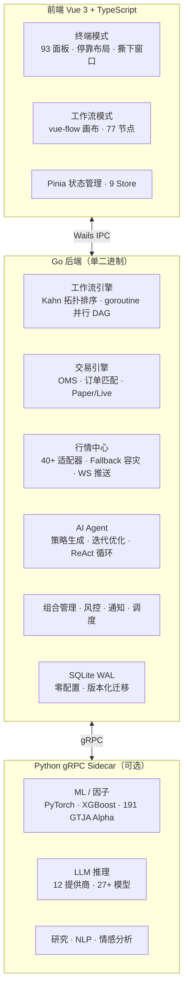

<p align="center">
  <picture>
    <source media="(prefers-color-scheme: dark)" srcset="https://img.shields.io/badge/QuantFlow-Terminal-111827?style=for-the-badge&logo=data:image/svg%2bxml;base64,PHN2ZyB4bWxucz0iaHR0cDovL3d3dy53My5vcmcvMjAwMC9zdmciIHdpZHRoPSI0MCIgaGVpZ2h0PSI0MCIgdmlld0JveD0iMCAwIDI0IDI0IiBmaWxsPSJub25lIiBzdHJva2U9IiNmZmZmZmYiIHN0cm9rZS13aWR0aD0iMiIgc3Ryb2tlLWxpbmVjYXA9InJvdW5kIiBzdHJva2UtbGluZWpvaW49InJvdW5kIj48cGF0aCBkPSJNMjIgMTIuMjJ2LS43N2E5IDkgMCAwIDAtMTAtOC4wN0EzLjUgMy41IDAgMCAwIDIgNi41djMuM2ExMCAxMCAwIDAgMCA1IDguNjd2MS4wM2ExLjUgMS41IDAgMCAwIDMgMHYtMS4zYTEwIDEwIDAgMCAwIDUtOC42M3oiLz48cGF0aCBkPSJNMTIgMjJWMTIuMjIiLz48cGF0aCBkPSJNMTIgMi41djQuMjIiLz48cGF0aCBkPSJNMTYgMTUuNDJhNCA0IDAgMCAwLTgtMHYtMy4yIi8+PC9zdmc+">
    
  </picture>
</p>

<h1 align="center">QuantFlow Terminal</h1>

<p align="center">
  <strong>双模式量化金融终端 — 彭博式面板终端 × 可视化工作流编排 × AI 策略生成</strong>
</p>

<p align="center">
  <a href="#-项目状态"></a>
  <a href="#-项目状态"></a>
  <a href="#-项目状态"></a>
  <a href="#-项目状态"></a>
  <a href="#-项目状态"></a>
  <br>
  <a href="https://golang.org"></a>
  <a href="https://vuejs.org"></a>
  <a href="https://www.sqlite.org"></a>
  <a href="https://www.python.org"></a>
  <a href="https://wails.io"></a>
  <a href="LICENSE"></a>
  <br>
  <a href="https://github.com/SZWzz/QuantFlow/actions"></a>
  <a href="https://github.com/SZWzz/QuantFlow/actions"></a>
</p>

<p align="center">
  <a href="README.md">中文</a> ·
  <a href="README.en.md">English</a> ·
  <a href="#-亮点">亮点</a> ·
  <a href="#-快速开始">快速开始</a> ·
  <a href="#-架构">架构</a> ·
  <a href="CHANGELOG.md">变更日志</a>
</p>

---

## ✨ 亮点

<table>
<tr>
<td width="50%">

### 🧠 AI 策略生成
自然语言 → 工作流 DAG 自动转换。LLM 理解交易意图，生成可执行策略，自动回测验证。

</td>
<td width="50%">

### ⚡ 实时 WebSocket 推送
Binance/OKX/Gate.io 原生 WS 连接，延迟 <100ms。自动重连 + HTTP 降级容灾。

</td>
</tr>
<tr>
<td>

### 📊 93 个分析面板
行情、交易、研究、风控、另类数据……彭博式停靠布局，自由拖拽，多窗口撕下。

</td>
<td>

### 🔗 77 个可组合节点
数据→因子→信号→交易→回测，Kahn 拓扑排序 + goroutine 并行 DAG 执行。

</td>
</tr>
<tr>
<td>

### 🌏 四市场覆盖
A 股 / 港股 / 美股 / 加密，T+1、涨跌停、印花税、PDT 规则全部正确实现。

</td>
<td>

### 🔒 本地优先
SQLite 单文件数据库，OS 原生密钥链加密。Python sidecar 可选——核心功能纯 Go 可用。

</td>
</tr>
</table>

---

## 📐 架构



**双模式联动**：
- **终端 → 工作流**：任意面板点 `[⊕]` → 自动生成工作流节点
- **工作流 → 终端**：执行结果「固定到面板」→ 实时监控

---

## 📊 项目状态

| 组件 | 状态 | 说明 |
|------|:----:|------|
| 工作流引擎（DAG + goroutine 并行 + 内容寻址缓存） | ✅ | 77 节点 · 20 类别 |
| 桌面壳（Wails v3 + Vue 3 + TypeScript） | ✅ | 双模式 · 撕下窗口 |
| 交易引擎（OMS + Paper/Live 双模式） | ✅ | 4 券商适配器 |
| WebSocket 实时推送（Binance/OKX/Gate.io） | ✅ | <100ms 延迟 · 自动降级 |
| 行情数据中心（40+ 适配器 · Fallback 容灾） | ✅ | A 股 11 源容灾 |
| 回测引擎（CN/US/HK/CRYPTO 市场规则） | ✅ | T+1/涨跌停/PDT/Wash Sale |
| Python gRPC Sidecar | ✅ | ML/因子/LLM/数据 |
| AI Agent（策略生成 + 迭代优化 + ReAct） | ✅ | NL→DAG 自动转换 |
| 可转债分析（双低排名 + BS 估值 + 条款监控） | ✅ | A 股 CB 市场 |
| 期权定价引擎（BS + Greeks + IV + 二叉树） | ✅ | 欧式/美式 · 纯 Go |
| 券商集成（Alpaca · Binance · IBKR · Futu） | ✅ | Paper/Live 双环境 |
| 面板虚拟化（不可见面板自动休眠） | ✅ | DockTab 可见性检测 |
| 组合与风险管理（VaR/CVaR/Sharpe/MaxDD） | ✅ | 多因子风险模型 |
| 通知 + 定时调度（Telegram + cron） | ✅ | 条件触发 |
| 主题系统（暗色/亮色 + 3 级密度） | ✅ | CSS 变量 · 运行时切换 |
| 国际化（中文/英文 · ~350 条/语言） | ✅ | vue-i18n |
| SQLite WAL 存储（零配置单文件） | ✅ | 版本化 schema 迁移 |

---

## 🔧 核心功能

### 工作流节点 · 77 个 · 20 类别

<details>
<summary>查看全部类别</summary>

| 类别 | 数量 | 代表节点 |
|------|:----:|---------|
| 数据加载 | 5 | DataLoader, Merge, Filter, Resample, DataNormalize |
| 技术指标 | 5 | SMA, MACD, RSI, EMA, Bollinger |
| Alpha 因子 | 13 | pct_change, delta, rank, zscore, cross_over, if_else 等 |
| 信号工程 | 8 | CrossSignal, Threshold, EntrySignal, ExitSignal, Rebalance 等 |
| 策略 | 1 | StrategyNode（金叉/RSI/动量/自定义） |
| 回测 | 1 | BacktestNode（CN/US/HK/CRYPTO） |
| 交易执行 | 4 | PlaceOrder, CancelOrder, OrderQuery, PositionQuery |
| 组合管理 | 2 | PortfolioSummary, Allocation |
| 风控 | 4 | StopLoss, PositionSizer, RiskMetrics, RiskModel |
| ML 引擎 | 8 | FeatureEngineer, TrainModel, Predict, EvaluateModel, AlphaMining, RL×3 |
| AI Agent | 1 | Agent（LLM 推理节点） |
| 研究分析 | 8 | Sentiment, StockResearch, Financials, PeerCompare, CBScanner 等 |
| 另类数据 | 4 | PredictionMarket, Geopolitics, GovData, Satellite |
| 通知 | 2 | Notify, Alert |
| 控制流 | 3 | Loop, if_condition, sub_workflow |
| 调度 | 3 | Schedule, Wait, WebhookTrigger |
| 工具 | 3 | HTTPRequest, MathOp, JSONParse |
| 输出 | 2 | LogOutput, ChartData |

</details>

### 前端面板 · 93 个

<details>
<summary>查看全部类别</summary>

| 类别 | 数量 | 面板 |
|------|:----:|------|
| **行情** | 17 | Watchlist, Candlestick, MarketOverview, Heatmap, DragonTiger, LimitUpDown, FundFlow, Margin, Funds, Futures, Bonds, SectorRotation, IPOCalendar, ExDividend, CBArbitrage, HKConnect, ShortInterest |
| **交易** | 8 | OrderEntry, OrderBlotter, Execution, BasketOrder, Position, PositionDetail, BrokerConfig, BrokerStatus |
| **组合** | 7 | PortfolioSummary, Rebalance, RiskDashboard, EquityCurve, TradeHistory, TradingJournal, ScenarioAnalysis |
| **研究** | 10 | StockResearch, Financials, Valuation, Audit, Forecast, PeerComparison, AnalystEstimates, InsiderTrading, CongressTrading, WashSale |
| **量化** | 10 | BacktestResult, FactorAnalysis, Distribution, MonteCarlo, CrossAssetCorr, AlphaMining, RLMonitor, Chanlun, Indicator, StockScanner |
| **图表** | 2 | SurfaceChart, Correlation |
| **AI/ML** | 5 | AIChat, ModelRegistry, PredictionDashboard, AlphaMiningWorkspace, AIStrategy |
| **加密** | 7 | CryptoOverview, FundingRate, Liquidation, DepthComparison, DeFiTVL, WhaleTracking, GasFee |
| **港股** | 4 | HKConnect, HKIPO, HKDerivatives, HKSettlement |
| **另类数据** | 4 | PredictionMarket, Geopolitics, Satellite, GovData |
| **资讯** | 2 | News, EconomicCalendar |
| **系统** | 7 | Settings, SystemMonitor, SchedulePanel, NotifyPanel, LogViewer, Storage, LayoutTemplates |

</details>

### 行情适配器 · 40+ · 4 市场全覆盖

<details>
<summary>查看详情</summary>

| 市场 | 适配器 |
|------|--------|
| **A 股** (11 源容灾) | Tencent · Sina · EastMoney · Baidu · Mootdx(TDX) · AKShare · TuShare · THS · cninfo · iWencai · MAC Protocol |
| **港股** (4 源) | Tencent · Sina · AKShare · Yahoo |
| **美股** (4 源) | Yahoo · Finnhub · Polygon · Alpaca |
| **加密** (5 源) | Binance · OKX · Gate.io · CoinGecko · Binance Futures |
| **WebSocket 推送** | Binance WS · OKX WS · Gate.io WS（<100ms 延迟） |
| **专项数据** | 新闻快讯 · 全球宏观(GDELT) · 资金流向 · 概念板块 · 财报 · 热度排名 · 北向资金 · 龙虎榜 · 可转债 · 卫星数据 · 预测市场(Polymarket) |

</details>

### AI Agent 系统

- **策略生成 Agent**（`internal/ai/strategy/`）：自然语言 → 工作流 DAG 自动转换。LLM 注入节点目录 + 端口类型约束，多层验证（JSON 解析/DAG 无环/端口兼容），失败时自动反馈重试（最多 3 轮）
- **策略迭代 Agent**：回测指标分析 → 参数调优建议，支持多轮迭代直到收敛
- **ReAct 循环**：think → act → observe，超时 + 步数限制
- **12 LLM 提供商**：OpenAI · Anthropic · DeepSeek · Ollama · Google · Mistral · Groq · SiliconFlow · Zhipu · OpenRouter · OpenCode · 自定义
- **流式输出**：SSE → 前端 Markdown 渲染 + 工具调用可视化

### 券商支持

| 券商 | 市场 | 状态 | 环境 |
|------|------|:----:|------|
| **Alpaca** | 美股 | ✅ 已实现 | Paper + Live |
| **Binance** | 加密 | ✅ 已实现 | Spot + Futures |
| **IBKR** | 全球 | ✅ 已实现 | Gateway REST API |
| **Futu（富途）** | 港股/美股/A 股 | ✅ 已实现 | FutuOpenD HTTP API |

### 可转债分析

- **双低排名**：`price + premium_rate` 标准公式排序
- **BS 期权估值**：纯债价值 + 转股期权价值 = 公允价值
- **条款监控**：回售触发价、强赎触发价、下修概率估算
- **cb_scanner 工作流节点**：参数化筛选 + 双低排序

### 期权定价引擎（纯 Go，无 Python 依赖）

- **Black-Scholes 定价** + 5 Greeks（Delta/Gamma/Theta/Vega/Rho）
- **隐含波动率**：Newton-Raphson + bisection fallback
- **CRR 二叉树**：支持美式期权提前行权
- **Go 绑定**：`App.ComputeOptionPrice()` 前端直调

---

## 🚀 快速开始

### 环境要求

- **Go** 1.25+
- **Node.js** 20+
- **Python** 3.12+（可选，ML/因子/LLM 需要）

### 开发

```bash
git clone https://github.com/SZWzz/QuantFlow.git
cd QuantFlow

# 开发模式（热重载）
wails dev

# 完整检查
go vet ./... && go test ./...                             # Go 后端 (967 tests)
cd frontend && npx vue-tsc --noEmit && npx vitest run     # 前端 (198 tests)
cd python && python -m pytest tests/ -x -q                # Python (25 tests)
```

### 构建

```bash
wails build          # 生产构建
```

---

## 🛠 技术栈

| 层 | 选择 | 理由 |
|----|------|------|
| 后端 | Go 1.25 | goroutine 并行 DAG，单二进制分发 |
| 桌面壳 | Wails v3 | Go 原生，零 IPC 开销 |
| 前端 | Vue 3 + TypeScript | vue-flow 画布，Pinia 状态管理 |
| 数据库 | SQLite WAL | 零配置单文件，桌面级并发 |
| 实时通信 | WebSocket (coder/websocket) | 内部 WS Hub + 外部交易所 WS |
| ML/AI | Python 3.12 (gRPC) | pandas/numpy 生态，独立 sidecar |
| 图表 | ECharts 5 | 金融图表全覆盖 + GL 3D 曲面 |
| 主题 | CSS Variables | 双主题 + 三密度，运行时切换 |

---

## 🌍 市场聚焦

| 市场 | 结算 | 关键规则 | 主要数据源 | 券商 |
|------|------|----------|-----------|------|
| A 股 | T+1 | 涨跌停 ±10%/±20%/±30%, 印花税 0.05% | Tencent/Sina/EM/Mootdx | 富途 |
| 港股 | T+2 | 港股通, 印花税 0.13% 双向 | Tencent/Sina/Yahoo | 富途/IBKR |
| 美股 | T+2 | PDT 规则, Wash Sale, 零股 | Yahoo/Finnhub/Polygon | Alpaca/IBKR |
| 加密 | 即时 | 永续资金费率, 强平 | Binance/OKX/Gate.io | Binance |

---

## 📁 项目结构

```
quantflow/
├── app.go, app_market.go, ...  # Wails API（Go→前端绑定）
├── internal/
│   ├── workflow/       # 工作流引擎 + 77 节点
│   ├── trading/        # 交易引擎 + 4 券商适配器
│   ├── market/         # 行情中心 + 40+ 适配器 + WS
│   ├── backtest/       # 回测引擎 (CN/US/HK/CRYPTO)
│   ├── ai/             # AI Agent + 策略生成/迭代
│   ├── research/       # 研究分析 + CB + 期权
│   ├── portfolio/      # 组合与风险管理
│   ├── python/         # gRPC 桥接（Go→Python）
│   ├── storage/        # SQLite WAL + 版本迁移
│   ├── ws/             # 内部 WebSocket Hub
│   └── notify/schedule/auth/config/logging/
├── frontend/src/
│   ├── terminal/       # 终端模式（DockView + 93 面板）
│   ├── workflow/       # 工作流模式（vue-flow 画布）
│   ├── stores/         # Pinia 状态管理（9 Store）
│   ├── lib/            # i18n · 主题 · composables
│   └── types/          # TypeScript 类型声明
├── python/src/         # Python gRPC Sidecar
│   ├── factor/         # 191 GTJA Alpha + 25 因子
│   ├── ml/             # XGBoost/PyTorch/RL
│   ├── llm/            # 12 提供商 LLM 推理
│   └── data/           # 多源数据抓取
├── docs/
│   ├── specs/          # 124 份设计文档
│   └── superpowers/plans/  # 111 份实施计划
└── CHANGELOG.md
```

---

## 📄 许可证

[AGPL-3.0](LICENSE) © 2024–2026 QuantFlow Contributors
