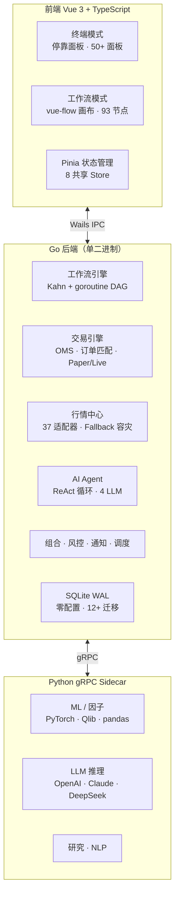

<p align="center">
  <picture>
    <source media="(prefers-color-scheme: dark)" srcset="https://img.shields.io/badge/QuantFlow-Terminal-111827?style=for-the-badge&logo=data:image/svg%2bxml;base64,PHN2ZyB4bWxucz0iaHR0cDovL3d3dy53My5vcmcvMjAwMC9zdmciIHdpZHRoPSI0MCIgaGVpZ2h0PSI0MCIgdmlld0JveD0iMCAwIDI0IDI0IiBmaWxsPSJub25lIiBzdHJva2U9IiNmZmZmZmYiIHN0cm9rZS13aWR0aD0iMiIgc3Ryb2tlLWxpbmVjYXA9InJvdW5kIiBzdHJva2UtbGluZWpvaW49InJvdW5kIj48cGF0aCBkPSJNMjIgMTIuMjJ2LS43N2E5IDkgMCAwIDAtMTAtOC4wN0EzLjUgMy41IDAgMCAwIDIgNi41djMuM2ExMCAxMCAwIDAgMCA1IDguNjd2MS4wM2ExLjUgMS41IDAgMCAwIDMgMHYtMS4zYTEwIDEwIDAgMCAwIDUtOC42M3oiLz48cGF0aCBkPSJNMTIgMjJWMTIuMjIiLz48cGF0aCBkPSJNMTIgMi41djQuMjIiLz48cGF0aCBkPSJNMTYgMTUuNDJhNCA0IDAgMCAwLTgtMHYtMy4yIi8+PC9zdmc+">
    
  </picture>
</p>

<h1 align="center">QuantFlow Terminal</h1>

<p align="center">
  <strong>双模式量化金融终端 — 彭博式面板终端 × 可视化工作流编排</strong>
</p>

<p align="center">
  <a href="#-项目状态"></a>
  <a href="#-项目状态"></a>
  <a href="#-项目状态"></a>
  <a href="#-项目状态"></a>
  <a href="#-项目状态"></a>
  <br>
  <a href="https://golang.org"></a>
  <a href="https://vuejs.org"></a>
  <a href="https://www.sqlite.org"></a>
  <a href="https://www.python.org"></a>
  <a href="LICENSE"></a>
</p>

<p align="center">
  <a href="README.md">中文</a> ·
  <a href="README.en.md">English</a> ·
  <a href="#-快速开始">快速开始</a> ·
  <a href="#-架构">架构</a>
</p>

---

## 架构



**双模式联动**：
- **终端→工作流**：任何面板点 `[⊕]` → 自动生成工作流节点
- **工作流→终端**：执行结果 `[固定到面板]` → 实时监控

---

## 项目状态

| 组件 | 状态 |
|------|:----:|
| 工作流引擎（DAG + goroutine 并行 + Kahn 拓扑排序） | ✅ |
| 桌面壳（Wails v3 + Vue 3 + TypeScript） | ✅ |
| 交易引擎（OMS + Paper/Live 双模式） | ✅ |
| 行情数据中心（37 适配器，Fallback 容灾，MAC 直连） | ✅ |
| 回测引擎（CN/US/HK/CRYPTO 市场规则） | ✅ |
| Python gRPC Sidecar | ✅ |
| AI Agent 系统（ReAct + 4 LLM + 15 技能） | ✅ |
| 券商集成（Alpaca 实盘 + Binance 实盘） | ✅ |
| 组合与风险管理（VaR/CVaR/Sharpe/MaxDD） | ✅ |
| 通知 + 定时调度（Telegram + cron） | ✅ |
| 主题系统（暗色/亮色 + 3 级密度） | ✅ |
| 国际化（中文/英文，~350 条/语言） | ✅ |
| SQLite WAL 存储（零配置单文件） | ✅ |

---

## 核心功能

### 工作流节点 · 93 个 · 18 类

<details>
<summary>查看全部类别</summary>

| 类别 | 数量 | 代表节点 |
|------|:----:|---------|
| 数据加载 | 4 | DataLoader, Merge, Filter, Resample |
| 技术指标 | 20 | SMA, MACD, RSI, EMA, Bollinger, OBV, MFI, PSY 等 |
| 缠论 | 5 | Bi（笔）, Duan（段）, Zhongshu（中枢）, 买卖点, 走势类型 |
| Alpha 因子 | 12 | pct_change, rank, zscore, cross_over, if_else 等 |
| 信号工程 | 8 | CrossSignal, Threshold, 持仓信号, 进出场 |
| 策略 | 1 | StrategyNode（金叉/RSI/动量/自定义） |
| 回测 | 1 | BacktestNode（CN/US/HK/CRYPTO） |
| 滑点模型 | 3 | Fixed / Percentage / VolumeSlippage |
| 交易执行 | 4 | PlaceOrder, CancelOrder, OrderQuery, PositionQuery |
| 组合管理 | 3 | PortfolioSummary, RiskMetrics, Allocation |
| 风控 | 2 | StopLoss, PositionSizer |
| ML 引擎 | 8 | 特征工程 + 训练/预测/评估 + RL×3 |
| AI Agent | 2 | FactorNode, AgentNode |
| 通知 | 2 | Notify, Alert |
| 控制流 | 3 | Loop, if_condition, sub_workflow |
| 调度 | 2 | Schedule, Wait |
| 研究分析 | 6 | Sentiment, 研报, 财务, 同行, 估值, 内幕 |
| 工具 | 5 | HTTPRequest, MathOperation, JSONParse, chart_data, fqfactor |

</details>

### 前端面板 · 64 个

<details>
<summary>查看全部类别</summary>

| 类别 | 面板 |
|------|------|
| **行情** (6) | Watchlist, QuoteDetail, Candlestick, MarketOverview, MarketDepth, Heatmap |
| **滚动行情** (1) | TickerTape |
| **交易** (8) | OrderEntry, OrderBlotter, Execution, BasketOrder, Position, PositionDetail, BrokerConfig, BrokerStatus |
| **组合** (3) | PortfolioSummary, Rebalance, RiskDashboard |
| **研究** (8) | 研报, 财务, 情绪, 同行对比, 分析师预测, 内幕交易, 国会交易, 因子分析 |
| **图表** (5) | EquityCurve, 相关性, 分布, MonteCarlo, 曲面图 |
| **AI/ML** (5) | AIChat, 模型注册, 预测面板, Alpha 挖掘, RL 监控 |
| **回测** (1) | BacktestResult |
| **因子** (1) | FQFactor |
| **加密** (1) | CryptoOverview |
| **缠论** (3) | ChanlunBi, ChanlunDuan, ChanlunZhongshu |
| **资讯** (1) | News |
| **工具** (3) | 画图, ActionCenter, MACProtocol |
| **系统** (4) | 调度, 通知, 设置, 系统监控 |

</details>

### 行情适配器 · 37 个 · 4 市场全覆盖

<details>
<summary>查看详情</summary>

| 市场 | 适配器 | 数量 |
|------|--------|:----:|
| **A 股** | mootdx(通达信) · MAC协议(TCP直连) · sina · eastmoney · tencent · baidu · akshare · tushare · ths · cninfo · iwencai | **11 源容灾** |
| **港股** | sina · akshare/tencent · yahoo | **3 源** |
| **美股** | yahoo(v8) · finnhub · polygon · alpaca | **4 源** |
| **加密** | gateio · binance · okx · coingecko | **4 源** |
| **专项** | 快讯/全球/资金流向/概念/信号/财报/热度/北向/MAC金钻/主力/板块 | **15 源** |

</details>

### AI Agent 系统

- **ReAct 循环**：think → act → observe，超时 + 步数限制
- **4 LLM 提供商**：OpenAI · Anthropic · DeepSeek · Ollama（本地部署）
- **15 技能**：技术分析、基本面分析、风控、策略、微观结构
- **流式输出**：SSE → 前端 Markdown 渲染 + 工具调用可视化

### 券商支持

| 券商 | 市场 | 状态 |
|------|------|:----:|
| **Alpaca** | 美股 | ✅ 实盘 |
| **Binance** | 加密 | ✅ 实盘 |
| **Futu（富途）** | 港股 | 🔧 待接入 |

### 缠论

Bi（笔）/ Duan（段）/ Zhongshu（中枢）/ 买卖点 / 走势类型 + 3 个可视化面板。
基于 MAC 协议 TCP 直连通达信，实时计算。

---

## 快速开始

### 环境要求

- **Go** 1.22+
- **Node.js** 20+
- **Python** 3.12+（可选，ML/因子/LLM 需要）

### 开发

```bash
git clone https://github.com/SZWzz/QuantFlow.git
cd QuantFlow

# 开发模式（热重载）
wails dev

# 完整检查
go vet ./... && go test ./...                             # Go 后端
cd frontend && npx vue-tsc --noEmit && npx vitest run     # 前端
cd python && python -m pytest tests/ -x -q                # Python
```

---

## 技术栈

| 层 | 选择 | 理由 |
|----|------|------|
| 后端 | Go 1.22+ | goroutine 并行，单二进制 |
| 桌面壳 | Wails v3 | Go 原生，零 IPC 开销 |
| 前端 | Vue 3 + TypeScript | vue-flow 画布，Pinia 状态管理 |
| 数据库 | SQLite WAL | 零配置单文件，桌面级并发 |
| ML/AI | Python 3.12+ (gRPC) | pandas/numpy 生态，独立 sidecar |
| 图表 | ECharts | 金融图表全覆盖 + GL 3D |
| 主题 | CSS Variables | 双主题 + 三密度，运行时切换 |

---

## 市场聚焦

| 市场 | 结算 | 关键规则 | 主要数据源 |
|------|------|----------|-----------|
| A 股 | T+1 | 涨跌停 ±10%/±20%, 印花税 0.05% | mootdx / MAC / 东财 / 新浪 / 腾讯 / 百度 / 同花顺 |
| 港股 | T+2 | 港股通, T+2 交收 | 新浪 / 腾讯 / AkShare / Yahoo |
| 美股 | T+2 | PDT 规则, wash sale | Yahoo / Finnhub / Polygon |
| 加密 | 即时 | 资金费率, 强平 | Gate.io / Binance / OKX |

---

## 许可证

[AGPL-3.0](LICENSE) © 2024–2026 QuantFlow Contributors
