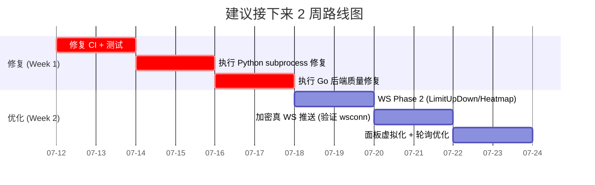

# QuantFlow Terminal — 全面评审报告

> 评审日期: 2026-07-11 | 基于版本: 2026.7.10 (Phase 12+)
> 提交数: 521 commits | 开发周期: 24 天

---

## 一、项目概览

| 维度 | 数据 |
|------|------|
| Go 生产代码 | 286 文件 |
| Vue 组件 | 128 (93 panels + 22 terminal + 12 workflow) |
| Python | ~240 文件 (含 191 个 GTJA alpha 因子的 zoo) |
| Spec 文档 | 124 份 |
| Plan 文档 | 111 份 |
| Go 测试 | 213 文件 ✅ |
| 前端测试 | 68 文件 (204 用例) |
| Python 测试 | 24 文件 |
| Workflow 节点 | ~100 |
| 数据适配器 | ~40 (17 注册 + 辅助) |
| 市场覆盖 | A 股 / 港股 / 美股 / 加密 |

### 正面评价

1. **开发纪律极强** — 124 份 spec + 111 份 plan 展示设计先行的工程文化，24 天完成此体量极为罕见
2. **技术栈一致性** — Wails v3 + Go + Vue 3 + SQLite，前后端共享类型，胶水代码极少
3. **市场覆盖完整** — 四市场适配器、交易引擎、回测引擎全部就位
4. **测试广度好** — 213 个 Go 测试文件覆盖 workflow、trading、market、backtest 核心模块
5. **Python factor zoo 是差异化优势** — 191 个 GTJA alpha + 深度学习/强化学习框架
6. **安全意识到位** — OS keychain 凭据管理、独立 security hardening spec
7. **金融正确性审查完善** — T+1 结算、wash sale、印花税、回测指标都有专项 spec 文件

---

## 二、关键问题

### P0 — 阻塞性问题

#### 1. CI 配置与 go.mod 版本不一致

```
ci.yml:  go-version: '1.22'        ← 写死的
go.mod:  go 1.25.0                  ← 实际要求
```

**GitHub Actions 上的 Go 后端 CI 永远失败。** 修复只需一行：`go-version: '1.25'`。

#### 2. 前端测试 23.5% 失败率

| 统计 | 数值 |
|------|------|
| 测试文件 | 22/68 失败 |
| 测试用例 | 48/204 失败 |
| 分布 | stores (data, portfolio) + 大量面板 (ActionCenter, BasketOrder, BrokerStatus, CryptoOverview, Geopolitics, Heatmap, MonteCarlo, OrderBlotter, PredictionMarket, Rebalance, Satellite, Sentiment, SurfaceChart, TickerTape, Watchlist 等) |

**根因推测：** 近期 WebSocket 重构 + OHLCV 变更 + store 接口调整，但对应 mock 和测试未同步更新。继续添加功能会加速恶化。

#### 3. Go 测试 1 个 flaky failure

```
FAIL: TestQuotePoller_FetchesAndPublishesData
     poller_test.go:130: expected market data hub to have cached message
```

时序/竞态问题。直接反映 `market/hub.go` 的 goroutine 同步存在隐患。

---

### P1 — 已设计但未执行的技术债

以下 Spec 全部已批准，有完整计划和代码，但尚未执行：

| Spec | 问题描述 | 实际状态 | 严重性 |
|------|---------|:--------:|:------:|
| **Python subprocess 瓶颈** `2026-07-09` | 每次数据请求 `subprocess.run(["python",...])` (~200ms 冷启动)，是全系统最大性能瓶颈。Python 端仍有 4 处 `subprocess.run`。 | ❌ 未动 | 🔴 性能 |
| **Wash sale 计算错误** `2026-07-09` | 亏损计算比较的是卖出价 vs 回购价，应该是 vs 原始成本价。影响用户回测 PnL。 | ❌ 未动 | 🔴 正确性 |
| **Stamp duty 未四舍五入** `2026-07-09` | `engine_cn.go:80` 仍是 `return tradeValue * e.stampDutyRate`。 | ❌ 未动 | 🟡 精度 |
| **美股默认 100 股** `2026-07-09` | `engine_us.go:193` 仍是 `qty = 100`，未改为 1。 | ❌ 未动 | 🟡 正确性 |
| **Sharpe 硬编码 2% 无风险利率** `2026-07-09` | 无 `RiskFreeRate`/`MetricsConfig`。 | ❌ 未动 | 🟡 正确性 |
| **Channel leak** `2026-07-09` | `hub.go` 仍用裸 `chan MarketMessage`，无 `type subscriber struct`。 | ❌ 未动 | 🟡 稳定性 |
| **Busy-wait 100% CPU** `2026-07-09` | `queue.go` 仍无 `sync.Cond`。 | ❌ 未动 | 🟡 性能 |
| **`golang.org/x/net` 版本过旧** `2026-07-09` | 仍是 `v0.53.0`。 | ❌ 未动 | 🟡 安全 |
| **ServiceStartup 上帝方法** `2026-07-09` | 仍是 ~496 行，`execQueue` 未移入 App struct。 | ❌ 未动 | 🟡 可维护 |
| **WebSocket Phase 2+** `2026-07-09` | Phase 1 除 TickerBar 外已完成，剩余 LimitUpDown、Heatmap 等。 | ⏳ TickerBar 已 WS，其余未动 | 🟡 延迟 |
| **前端架构重构** `2026-07-09` | `useRealtimeData` hook 已建。大组件拆分、面板虚拟化、代码分割未执行。 | ⏳ 部分完成 | 🟡 性能 |
| **安全加固** `2026-07-09` | OS keychain 加密已实现（`master_key_darwin.go`），`credential.go` 已使用。 | ✅ **已完成** | 🟡 安全 |

---

### P2 — 架构隐患

#### 4. 93 个面板无虚拟化策略

所有面板同时加载，即使不可见也保持活跃 WebSocket 订阅。`TerminalMode.vue` 已有 `v-if="active"` 模式但大量面板未遵循。内存和 WS 连接数随面板数线性增长。

#### 5. 缺少 E2E 测试

财务类应用，CRUD 操作的正确性完全依赖单元测试和手动测试。Wails 应用的 E2E 可用 Playwright + `wails dev` 实现。

#### 6. Python sidecar 仍是单体

`server.py` 一个入口，所有服务注册在一起。没有健康检查和 graceful degradation。Subprocess 路径阻塞 asyncio 事件循环。

#### 7. Schema migration 未经生产验证

虽然 `internal/storage/migrate.go` 存在版本化迁移机制，项目 24 天尚未经过真实 schema 变更考验。

---

## 三、WebSocket 迁移深度分析

### 3.1 当前架构的真相

**很多人以为的 WebSocket 迁移：**
```
外部交易所 WSS → Go 适配器 → wsHub → 前端
```

**实际架构：**
```
外部 REST API (5s 轮询) → QuotePoller (Go) → wsHub → 前端 WebSocket
                                                 ↑ 只这一段是 WS
```

**2026-07-04 完成的"WS 迁移"解决的是**前端到后端的通信方式（IPC 轮询 → WS 订阅），**后端到外部数据源的通信仍然是 5s HTTP 轮询**。延迟从 ~10s 降到 ~5s，但没有质变。

### 3.2 各市场数据源 WebSocket 支持能力

#### ❌ A 股 — 完全不支持

| 数据源 | 协议 | WS 支持 |
|--------|:----:|:-------:|
| 腾讯 `qt.gtimg.cn` | HTTP REST | ❌ |
| 新浪 `hq.sinajs.cn` | HTTP REST | ❌ |
| 东方财富 `push2.eastmoney.com` | HTTP REST | ❌ |
| 通达信 (via mootdx→Python) | 专有 TCP | ❌ |
| AKShare | HTTP 包装 | ❌ |
| TuShare | HTTP REST | ❌ |

**A 股没有任何公开的 WebSocket 行情源。** 唯一实时方案是付费 Level-2（通达信/万得/东财 TCP 私有协议），但那需要单独适配。

#### ❌ 港股 — 基本不支持

| 数据源 | 协议 | WS 支持 |
|--------|:----:|:-------:|
| Yahoo Finance | HTTP REST | ❌ 旧版 WS 已停 |
| 腾讯 `qt.gtimg.cn` | HTTP REST | ❌ |
| 新浪 | HTTP REST | ❌ |
| AKShare | HTTP | ❌ |

#### ⚠️ 美股 — 部分支持(需付费 API Key)

| Finnhub | HTTP + WSS | ✅ `wss://ws.finnhub.io` 免费层也有 |
| Polygon.io | HTTP + WSS | ✅ 需付费订阅 |
| Yahoo Finance | HTTP | ❌ |

#### ✅ 加密 — 原生支持 WebSocket

| 数据源 | 协议 | WS 端点 |
|--------|:----:|:-------:|
| Binance Spot | HTTP + WSS | ✅ `wss://stream.binance.com:9443/ws` |
| Binance Futures | HTTP + WSS | ✅ `wss://fstream.binance.com/ws` |
| OKX | HTTP + WSS | ✅ `wss://ws.okx.com:8443/ws/v5/public` |
| Gate.io | HTTP + WSS | ✅ `wss://api.gateio.ws/ws/v4/` |
| CoinGecko | HTTP only | ❌ |

### 3.3 总结

| 目标 | 可行性 | 当前延迟 | WS 后延迟 |
|:----|:------:|:--------:|:---------:|
| 前端→后端 WS | ✅ 已实现 | ~5s | ~5s (同) |
| 加密实时推送 | ✅ 可做 | 5s | **<100ms** |
| 美股实时推送 | ⚠️ 需付费 | 5s | **1-2s** |
| A 股实时推送 | ❌ 不可能 | 5s | 5s (不变) |

**A 股不支持 WS 是数据源的物理限制，不是代码问题。** 加密是唯一可以真正实现推模式的市场。

### 3.4 Phase 1 实际完成度

| 原计划 Task | 状态 |
|------------|:----:|
| 重构 `ws/handler.go` — 移除 DefaultHub 全局变量 | ✅ |
| 创建 `MarketWSService` | ✅ |
| 创建 `QuotePoller` | ✅ (实现与 spec 有差异: pollOnce 直接从 wsHub.GetTopics 发现订阅，而非维护内部 subs map) |
| 创建 `MinutePoller` | ✅ |
| 创建 `useRealtimeData` composable | ✅ |
| CandlestickPanel 分时图 → WS | ✅ |
| TickerBar → WS | ✅ **前端已 WS**（无 `TickerPoller`，走通用 QuotePoller） |
| WatchlistPanel → WS | ✅ |
| MarketOverview → WS | ✅ |
| Phase 2+ (涨跌停/热力图等) | ⛔ **未开始** |

---

## 四、下一步建议（按优先级排列）

### 1. 🔴 修复 CI 和测试 (1-2 天)

```
优先级: P0 | 影响: 阻塞所有后续开发
```

- `ci.yml`: `go-version: '1.22'` → `'1.25'`
- 批量修复 48 个前端测试失败 (更新 mock 以匹配新 WS store 接口)
- 修复 flaky `TestQuotePoller_FetchesAndPublishesData` (增加等待或改用回调确认)

### 2. 🔴 执行已批准的 Spec (3-5 天)

```
优先级: P1 | 影响: 性能、正确性、安全
```

投入产出比最高的 3 个：

1. **Python subprocess → importlib** (`docs/specs/2026-07-09-python-sidecar-overhaul.md`) — 全系统最大性能瓶颈。替换 `subprocess.run` 为 `importlib` + `getattr`，200ms → <1ms。
2. **Wash sale 计算修复** (`docs/specs/2026-07-09-go-backend-quality.md`) — 财务正确性问题，直接影响用户回测 PnL。
3. **Channel leak + Busy-wait** — 资源泄漏和 CPU 空转，长期不可持续。

### 3. 🟡 WebSocket Phase 2 — LimitUpDown + Heatmap (1-2 天)

```
优先级: P2 | 影响: 用户体验
注意: TickerBar 前端已 WS 完成，无需单独做
```
- `AbnormalPoller` + LimitUpDownPanel → WS
- `IndustryPoller` + HeatmapPanel → WS

### 4. 🟢 加密市场真 WS 推送 (2-3 天) — 关键差异化

```
优先级: P2 | 影响: 性能标杆 + 架构验证
```

**这是唯一能真正实现推模式、验证 wsconn 框架的市场。** 即使 A 股不能，加密市场的实时体验也能拉开产品差距。

新建 `internal/market/wsconn/manager.go`：
```go
type WSConnManager struct {
    conns  map[string]*WSConn    // 交易所 → 连接
    hub    *MarketDataHub
    // 共享: 重连、ping/pong、订阅管理
}
```

适配器增加 WS 连接能力（接口不变，新增可选接口）：
- BinanceAdapter 增加 `ConnectWS(ctx) → error`
- 当 WS 活跃时通过 `marketHub.Publish` 直接推送
- WS 断开回退到 HTTP 轮询

**数据流：**
```
Binance WSS → wsconn.Manager → marketHub.Publish → wsHub → 前端 WS
              (推模式)                                   (推模式)
```

**不修改 CN/US 的 HTTP 轮询链，并行运行，互不影响。**

### 5. 🟡 面板虚拟化 + 懒加载 (2-3 天)

```
优先级: P2 | 影响: 内存、连接数
```

- 不可见面板自动取消 WS 订阅
- 目标：从 93 个活跃连接降到 ~10-15 个

### 6. 🟢 自适应轮询器优化 (1 天)

```
优先级: P3 | 影响: 性能
```

不改架构，纯优化：
- 交易时段 3s 轮询，盘后 60s 或停轮
- 批量聚合请求（新浪/腾讯支持逗号分隔多个 symbol）
- QuotePoller 合并 `MinutePoller` 共用 ticker

### 7. 🟢 E2E 测试体系 (3-5 天)

```
优先级: P3 | 影响: 质量保障
```

Playwright + `wails dev`，覆盖：启动 → 加载面板 → 查询行情 → 下单 → 回测 → 工作流。

### 8. 🟢 文档和部署

```
优先级: P3 | 影响: 团队协作
```

- ADR (架构决策记录)
- 93 面板 + 100 节点的索引文档
- `wails build` 打包 + 代码签名分发

---

## 五、战略建议

### 当前阶段定位

**QuantFlow 是一个 24 天内功能密度极高的项目，目前处于"功能过剩、质量债务积累"的阶段。**

最大风险**不是缺少功能**（远超 MVP），而是：
1. 已批准的修复 spec 积压未执行
2. 测试未随重构同步更新
3. CI 配置错误形同虚设

### 建议冻结新功能



### 下一步最有影响力的功能方向

1. **加密市场真 WebSocket 推送** — 验证全链路推模式架构，拉开产品差距，即使 A 股不能
2. **实盘接入验证** — Alpaca/富途/IBKR 实盘交易（适配器已写好但未实盘测试）
3. **AI Agent + Workflow Engine 结合** — 自然语言策略生成，这是真正的长期护城河
