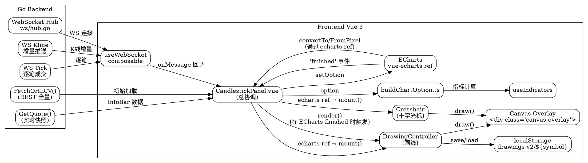

# K 线图综合优化：对标同花顺

## Motivation

当前 CandlestickPanel 已实现 K 线/分时/多日分时三模式、5 项技术指标、增量加载和竞争条件防护，代码质量良好。但与同花顺等专业终端相比，存在明显体感差距：数据更新靠轮询（30s/5s）、无法画线标注、信息密度低、缺少实时推送、交互方式单一。同时，独立的 DrawingPanel 作为白板画布与 K 线完全脱节，功能重叠且无法复用。

本 spec 的目标是一次性补齐这些差距，并将 DrawingPanel 的画线能力内聚到 K 线图中，删除独立面板。

## Design

### 总体架构

```
CandlestickPanel.vue
├── TabBar (K线 / 分时 / 多日分时)
├── Toolbar (区间选择器 / 叠加指标 / 副图指标 / 画线模式切换)
├── InfoBar (最新价 / 涨跌幅 / 换手率 / 量比 / 振幅 / 均价 / 内外盘)
├── ChartContainer (position: relative)
│   ├── ECharts Instance (vue-echarts, ref 暴露给 panel)
│   │   ├── K线/分时/多日分时 (主图)
│   │   ├── 叠加指标 (MA/BB/SAR/EMA)
│   │   ├── 副图 (Volume/MACD/KDJ/RSI/WR/CCI/OBV)
│   │   ├── 事件标记 (markLine: 除权除息/涨停跌停/财报)
│   │   ├── 大盘叠加 (可选上证/深证/创业板折线)
│   │   └── Volume Profile (右侧纵向分布)
│   └── Canvas Overlay (pointer-events: none → auto, z-index: 10)
│       ├── DrawingController (画线交互 + 渲染)
│       └── Crosshair (自定义十字光标 + 数据浮层)
├── DrawingToolbar (浮动, 画线模式切换/颜色/清空)
├── IndicatorParamPanel (叠加/副图指标参数调节)
└── ContextMenu (右键: 切换周期/指标/删除画线/截图)
```

### 1. WebSocket 实时数据层

Go 后端新增 WebSocket hub，前端新增 `useWebSocket` composable。

```
Go Backend
└── app/internal/ws/
    ├── hub.go          — 连接注册/注销, 主题分发
    ├── client.go       — 单个 WS 连接, 读写 goroutine
    ├── topics/
    │   ├── kline.go    — K线增量: {symbol, interval, bar} (最后一根 candle 实时更新)
    │   ├── tick.go     — 逐笔成交: {symbol, price, volume, time, side}
    │   └── depth.go    — 十档行情: {symbol, bids, asks}
    └── handler.go      — HTTP upgrade handler, Wails 路由

前端
└── frontend/src/lib/composables/useWebSocket.ts
    ├── connect(url, topics[]) → void
    ├── onMessage(topic, handler) → unsub
    ├── reconnect (指数退避: 1s → 2s → 4s → 8s → max 30s)
    └── heartbeat (ping/pong 15s 间隔)
```

**数据流变更**:
- 首次加载: HTTP REST (`FetchOHLCV`) → 全量数据 → 渲染
- 实时阶段: WS 推送增量 → 合并到 ohlcvData ref → ECharts appendData
- 分时图同理: 首次全量 → WS tick 推送 → 最后一笔更新
- 降级: WS 断连 → 回退到 30s/5s 轮询

**Go 侧新增类型**:

```go
// hub.go
type Hub struct {
    clients    map[*Client]bool
    broadcast  chan *Message
    register   chan *Client
    unregister chan *Client
    topics     map[string]map[*Client]bool  // topic → clients
}

type Message struct {
    Topic string      `json:"topic"`
    Data  json.RawMessage `json:"data"`
}

// topics/kline.go
type KlineUpdate struct {
    Symbol   string  `json:"symbol"`
    Interval string  `json:"interval"`
    Time     int64   `json:"time"`
    Open     float64 `json:"open"`
    High     float64 `json:"high"`
    Low      float64 `json:"low"`
    Close    float64 `json:"close"`
    Volume   float64 `json:"volume"`
    IsClosed bool    `json:"is_closed"` // true=新K线已生成, false=当前K线实时更新
}
```

### 2. 画线工具集成 (来自 DrawingPanel)

将 DrawingPanel.vue 的画线能力提取为 `DrawingController` composable，挂载到 ECharts 之上的 Canvas overlay。

#### 坐标映射改造 (核心变更)

当前 DrawingPanel 存储像素坐标；改造后存储**数据坐标**，保证缩放平移后图形位置正确。

```ts
// 存储格式 (localStorage, 按 symbol 分)
interface DrawingShape {
  id: number
  type: 'trendline' | 'horizontal' | 'fibonacci' | 'text'
  points: { dataIndex: number; price: number }[]
  color: string
  text?: string
}

// 渲染: data-space → pixel-space
// echarts.convertToPixel({seriesIndex: 0}, [dataIndex, price])

// 交互: pixel-space → data-space
// echarts.convertFromPixel({seriesIndex: 0}, [pixelX, pixelY])
```

#### DrawingController 实现

```ts
// frontend/src/lib/chart/DrawingController.ts
class DrawingController {
  private echarts: EChartsInstance
  private canvas: HTMLCanvasElement
  private ctx: CanvasRenderingContext2D
  private mode: 'cursor' | 'trendline' | 'horizontal' | 'fibonacci' | 'text'
  private drawings: Map<string, DrawingShape[]>  // key = symbol
  private activeSymbol: string
  private isDrawing: boolean
  private startPoint: { dataIndex: number; price: number } | null
  private color: string

  // 生命周期
  mount(echarts: EChartsInstance, canvas: HTMLCanvasElement): void
  destroy(): void

  // 模式切换
  setMode(mode): void
  setColor(color: string): void

  // 数据管理
  loadDrawings(symbol: string): void
  saveDrawings(): void
  clearAll(): void

  // 渲染 (每次 ECharts 'finished' 事件触发)
  render(): void  // 清空 canvas → 遍历 drawings → convertToPixel → drawShape

  // 交互事件 (Canvas overlay 上监听)
  onMouseDown(e): void
  onMouseMove(e): void
  onMouseUp(e): void

  // 坐标工具
  private toDataSpace(pixelX, pixelY): [number, number]
  private toPixelSpace(dataIndex, price): [number, number]
  private drawShape(ctx, shape): void  // 同现有 DrawingPanel.drawShape
}
```

#### Canvas Overlay 样式

```css
.canvas-overlay {
  position: absolute;
  top: 0;
  left: 0;
  width: 100%;
  height: 100%;
  pointer-events: none;  /* 默认穿透, 让 ECharts 处理滚轮/平移 */
  z-index: 10;
}
.canvas-overlay.drawing-mode {
  pointer-events: auto;  /* 画线模式下拦截鼠标事件 */
  cursor: crosshair;
}
```

#### 快捷键

- `Shift+D`: 切换画线模式 (cursor ↔ 上次使用的画线工具)
- `Escape`: 取消当前绘制 / 退出画线模式
- `Delete`: 删除选中的图形

### 3. 增强十字光标

自定义十字光标替代 ECharts 默认 tooltip，以实现同花顺风格的信息密度。

```
┌─────────────────────────────────────────────┐
│  时间 │ 开 │ 高 │ 低 │ 收 │ 涨跌 │ 涨跌幅 │  成交量 │
├─────────────────────────────────────────────┤
│ 07/02  12.34  12.56  12.20  12.45  +0.11  +0.89%  23.4万  │
└─────────────────────────────────────────────┘
```

实现方案：`Crosshair.ts` — 禁用 ECharts 默认十字线，在 Canvas overlay 上自行绘制。

```ts
// frontend/src/lib/chart/Crosshair.ts
class Crosshair {
  private enabled: boolean
  private onHover: (data: CrosshairData | null) => void

  render(ctx, echarts): void {
    // 1. 垂直线 + 水平线 (细线, 跟随鼠标)
    // 2. 侧边标尺: 左侧价格轴高亮, 底部时间轴高亮
    // 3. 浮动信息面板: 根据鼠标位置获取数据点
  }
}
```

### 4. 事件标记

在 K 线图上标注关键事件，使用 ECharts `markLine` + `markArea`。

| 事件类型 | 渲染方式 | 数据来源 |
|---------|---------|---------|
| 除权除息 | markLine (竖线 + 标签) | `App.GetExDividend(symbol)` |
| 涨停/跌停 | markArea (红色/绿色背景块) | 从 K 线数据判断 (close === limit_up/down) |
| 财报发布 | markLine (竖线 + 财报图标) | `App.GetEarningsCalendar(symbol)` |
| 分红 | markLine (竖线 + 标签) | 同除权除息 |
| 大盘异常 | markLine (竖线 + 标注) | 熔断/千股跌停等 |

数据在 `buildChartOption` 阶段注入：

```ts
// buildChartOption.ts
function buildKlineOption(...): ECBasicOption {
  // ...
  return {
    series: [{
      type: 'candlestick',
      data: ohlcvData,
      markLine: {
        data: eventMarkers.map(e => ({
          xAxis: e.dataIndex,
          label: { formatter: e.label },
          lineStyle: { color: e.color, type: 'dashed' as const }
        }))
      },
      // ...
    }]
  }
}
```

### 5. 大盘指数叠加

用户可选择将上证指数/深证成指/创业板指折线叠加到 K 线图上。

```ts
// CandlestickPanel.vue
const indexOverlay = ref<'none' | '000001' | '399001' | '399006'>('none')

watch(indexOverlay, async (idx) => {
  if (idx === 'none') { indexData.value = null; return }
  // FetchOHLCV(idx, '1d', ...) → 归一化到主图价格区间
  // → buildKlineOption 中追加 LineChart series
})
```

归一化算法: 将叠加指数缩放到主图价格区间，显示在右侧副 Y 轴。

```ts
// 归一化: (price - min) / (max - min) * (主图区间) + 主图最低价
// 在 buildChartOption 中计算
```

### 6. 指标扩展与参数面板

#### 新增指标

| 指标 | 适用图表 | 实现 |
|------|---------|------|
| SAR | K 线 | `useIndicators.sar(high, low, 0.02, 0.2)` |
| EMA | K 线 | `useIndicators.ema(close, period)` (已有 sma, 新增 ema) |
| CCI | K 线 | `useIndicators.cci(high, low, close, 20)` |
| OBV | K 线 副图 | `useIndicators.obv(close, volume)` |
| Volume Profile | K 线 | 右侧纵向成交量分布图 (ECharts 自定义图表) |

#### 参数面板

新增 `IndicatorParamPanel` 组件，点击指标名称展开参数调节浮层：

```
MA ────────────────┬── [5] [10] [20] [60]    ← 点击数字可编辑
BB ────────────────┬── 周期:20  倍数:2
MACD ──────────────┬── 快:12  慢:26  信号:9
KDJ ───────────────┬── K:9  D:3  J:3
RSI ───────────────┬── 周期:14
```

参数变更触发 `indicatorParams` ref 更新 → `buildChartOption` 重新生成 option。

### 7. 信息栏 (InfoBar)

在图表上方增加一条信息栏，展示当前品种的关键数据：

```
┌──────────────────────────────────────────────────────────────────────────────┐
│ 600519  贵州茅台  1,485.30  +23.50  +1.61%  换手 0.32%  量比 0.87  振幅 2.13%  │
│ 均价 1,478.20  内盘 1.2万  外盘 1.5万  流通市值 1.87万亿  市盈率 28.5         │
└──────────────────────────────────────────────────────────────────────────────┘
```

数据来源: `App.GetQuote(symbol)` — 已有接口，当前只获取买一卖一价格，需扩展返回字段。

### 8. 快捷键与交互

| 快捷键 | 功能 |
|--------|------|
| `←` / `→` | 切换 K 线周期 (1m→5m→15m→30m→1h→1d→1w) |
| `↑` / `↓` | 缩放 K 线显示数量 |
| `G` | 跳转到指定日期 (弹出日期选择器) |
| `Shift+D` | 切换画线模式 |
| `Esc` | 取消绘制 / 退出画线模式 |
| `Delete` | 删除选中画线 |
| `F` | 切换 Fibonacci 工具 |
| `T` | 切换趋势线工具 |
| 右键 → 菜单 | 切换周期/指标/删除画线/截图 |

### 9. 移除独立 DrawingPanel

- 删除 `frontend/src/terminal/panels/DrawingPanel.vue`
- 删除 `frontend/src/terminal/panels/__tests__/DrawingPanel.test.ts`
- 删除 `registry.ts` 第 56 行的 `drawing` 注册

### 10. Graphviz 组件交互图



## 数据流

### K 线首屏加载
```
Go FetchOHLCV() → JSON → CandlestickPanel.loadOHLCV()
  → ohlcvData ref → buildChartOption(ohlcvData, overlay, bottomMode, ...)
    → ECharts option → 渲染

同时: DrawingController.loadDrawings(symbol) → localStorage
  → render() echarts.convertToPixel → Canvas overlay → 画线
```

### K 线实时更新
```
WS KlineUpdate → useWebSocket.onMessage('kline')
  → mergeIntoOHLCV(ohlcvData.value, update)  // 更新最后一根或追加新K线
    → buildChartOption → ECharts.setOption (notMerge)
      → ECharts 'finished' → DrawingController.render()  // 画线追随新坐标
```

### 画线交互
```
用户 Shift+D → drawingMode = true → Canvas overlay pointer-events: auto
用户 mousedown → DrawingController.onMouseDown
  → echarts.convertFromPixel([x, y]) → [dataIndex, price]
用户 mousemove → onMouseMove → echarts.convertFromPixel → render 预览
用户 mouseup → onMouseUp → 保存 DrawingShape → localStorage
  → render() 最终绘制
```

## 新增/修改文件

| 文件 | 动作 | 说明 |
|------|------|------|
| `app/internal/ws/hub.go` | 新增 | WebSocket hub: 连接/主题管理 |
| `app/internal/ws/client.go` | 新增 | WebSocket 客户端: 读写/心跳 |
| `app/internal/ws/topics/kline.go` | 新增 | K 线增量推送类型定义 |
| `app/internal/ws/topics/tick.go` | 新增 | 逐笔成交推送类型定义 |
| `app/internal/ws/topics/depth.go` | 新增 | 深度推送类型定义 |
| `app/internal/ws/handler.go` | 新增 | HTTP upgrade handler (Wails 路由) |
| `frontend/src/lib/composables/useWebSocket.ts` | 新增 | WS 连接管理 composable |
| `frontend/src/lib/chart/DrawingController.ts` | 新增 | 画线控制器 (从 DrawingPanel 提取核心逻辑) |
| `frontend/src/lib/chart/Crosshair.ts` | 新增 | 自定义十字光标 + 数据浮层 |
| `frontend/src/lib/chart/EventMarker.ts` | 新增 | 事件标记数据聚合 |
| `frontend/src/lib/composables/useIndicators.ts` | 修改 | 新增 sar/ema/cci/obv |
| `frontend/src/lib/buildChartOption.ts` | 修改 | 新增 SAR/EMA 叠加、事件标记、大盘叠加、副图 CCI/OBV、Volume Profile |
| `frontend/src/terminal/panels/CandlestickPanel.vue` | 修改 | 集成所有新功能 (~900 行) |
| `frontend/src/terminal/components/panel/KlineChart.vue` | 修改 | 暴露 ECharts 实例 ref |
| `frontend/src/terminal/components/panel/IndicatorParamPanel.vue` | 新增 | 指标参数调节子组件 |
| `frontend/src/terminal/components/panel/InfoBar.vue` | 新增 | 图表上方信息栏 |
| `frontend/src/terminal/panels/DrawingPanel.vue` | 删除 | 被 DrawingController 替代 |
| `frontend/src/terminal/panels/__tests__/DrawingPanel.test.ts` | 删除 | 不再需要 |
| `frontend/src/terminal/panels/registry.ts` | 修改 | 移除 drawing 注册 |
| `frontend/src/lib/canvas-theme.ts` | 保留 | DrawingController 仍使用 |

## API 变更

### 新增 Go 导出函数

```go
// app.go
func (a *App) GetMarketIndexData(symbol string, start, end int64) ([]OHLCVBar, error)
// 获取大盘指数数据用于叠加

func (a *App) GetExDividend(symbol string) ([]EventMarker, error)
// 获取除权除息事件

func (a *App) GetEarningsDates(symbol string) ([]int64, error)
// 获取财报发布日期
```

### 扩展 GetQuote 返回值

```go
// GetQuote 返回增加字段
type QuoteData struct {
    // ... 现有字段
    TurnoverRate  float64 `json:"turnover_rate"`   // 换手率
    VolumeRatio   float64 `json:"volume_ratio"`    // 量比
    Amplitude     float64 `json:"amplitude"`       // 振幅
    AvgPrice      float64 `json:"avg_price"`       // 均价
    InsideVolume  float64 `json:"inside_volume"`   // 内盘
    OutsideVolume float64 `json:"outside_volume"`  // 外盘
    MarketCap     float64 `json:"market_cap"`      // 流通市值
    PeRatio       float64 `json:"pe_ratio"`        // 市盈率
    LimitUp       float64 `json:"limit_up"`        // 涨停价
    LimitDown     float64 `json:"limit_down"`      // 跌停价
}
```

### WebSocket 端点

```
ws://localhost:9876/ws?token=<jwt>
订阅: {"type":"subscribe","topics":["kline:600519:1d","tick:600519"]}
取消: {"type":"unsubscribe","topics":["kline:600519:1d"]}
推送: {"topic":"kline:600519:1d","data":{...KlineUpdate}}
```

## 依赖

- WebSocket 使用 Go 标准库 `golang.org/x/net/websocket` 或 `github.com/coder/websocket`（项目已存在 `go.sum` 中）
- 前端无需新增 npm 包（Canvas 2D API 为浏览器原生）

## Acceptance Criteria

- [ ] WebSocket: K 线增量推送在 1s 内更新到图表，断连后 30s 内自动重连并回退轮询
- [ ] 画线工具: 趋势线/水平线/斐波那契/文字四种工具可在 K 线上绘制，缩放平移后位置正确，切换 symbol 后恢复
- [ ] 删除 DrawingPanel: registry 无 `drawing` 注册项，对应文件已移除
- [ ] 十字光标: 鼠标悬停显示自定义十字线 + 详细数据浮层
- [ ] 事件标记: K 线图上显示除权除息/涨停跌停标记
- [ ] 大盘叠加: 可选择叠加上证/深证/创业板指折线
- [ ] 指标扩展: SAR/EMA/CCI/OBV 四项指标可正常计算和显示
- [ ] 指标参数: 点击指标名称可调节参数，参数变更后图表即时更新
- [ ] InfoBar: 图表上方显示涨跌幅/换手率/量比/振幅/均价等数据
- [ ] 快捷键: ← → ↑ ↓ G Shift+D Esc Delete 均可正常工作
- [ ] 右键菜单: 右键弹出周期/指标切换菜单
- [ ] 回归: 现有 K 线/分时/多日分时功能不变，现有测试通过
- [ ] `cd frontend && npx vue-tsc --noEmit` 无类型错误
- [ ] `cd app && go vet ./...` 无警告
- [ ] `cd frontend && npx vitest run` 全部通过

## Risks / Trade-offs

| 风险 | 缓解 |
|------|------|
| WebSocket 增加后端复杂性 | WS hub 设计为独立包，不影响现有 REST 接口；WS 断连自动降级轮询 |
| Canvas overlay 与 ECharts 事件冲突 | 通过 pointer-events 切换解决：非画线模式穿透给 ECharts，画线模式拦截 |
| 大版本变更回归风险 | 所有新功能均为增量添加，不修改现有数据流；分步提交流程确保每个步骤可测试 |
| localStorage 画线数据迁移 | 格式从像素坐标改为数据坐标，旧数据不兼容。使用新 key (`drawings-v2`) 避免冲突 |
| 十字光标覆盖 ECharts 默认 tooltip | 需禁用 ECharts tooltip + dataZoom tooltip，改为 Canvas 自绘 |
| 性能: 画线 + 十字光标 + ECharts 三渲染叠加 | Crosshair 使用 requestAnimationFrame 节流，画线仅在 ECharts 'finished' 事件时重绘 |
